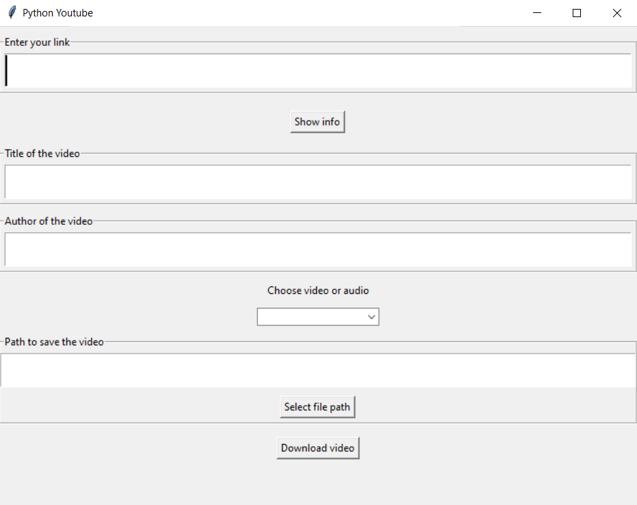
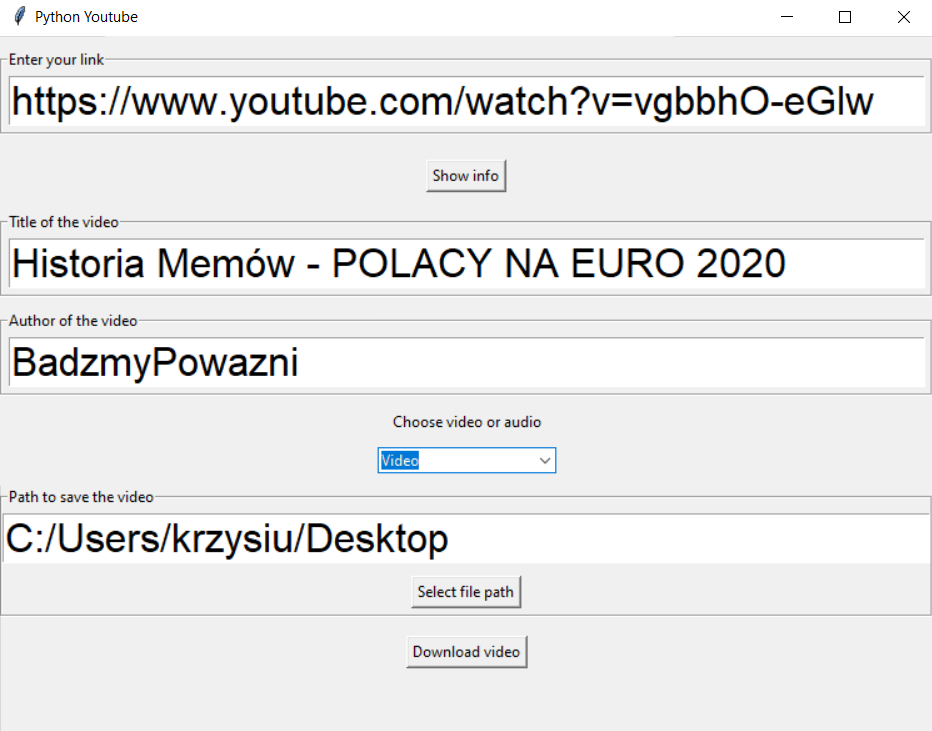

## Youtube Python
The purpose of this project was to create an application to download videos from Youtube. A graphical user interface has been built using the Tkinter module. Pytube module has been used to download videos.

## A look on how the application works
This is what shows up when a user runs the application

- First, user has to provide the link to the video and click 'Show info' button.
- If everything went fine, title and author of the video should show up.
- Next, user has to choose eiter video or audio format of downloaded video.
- After that, user has to provide the path to save the video (it is choosen using File Explorer)
- In this moment, application should look like that

- Now, 'Download video' button should be clicked 

